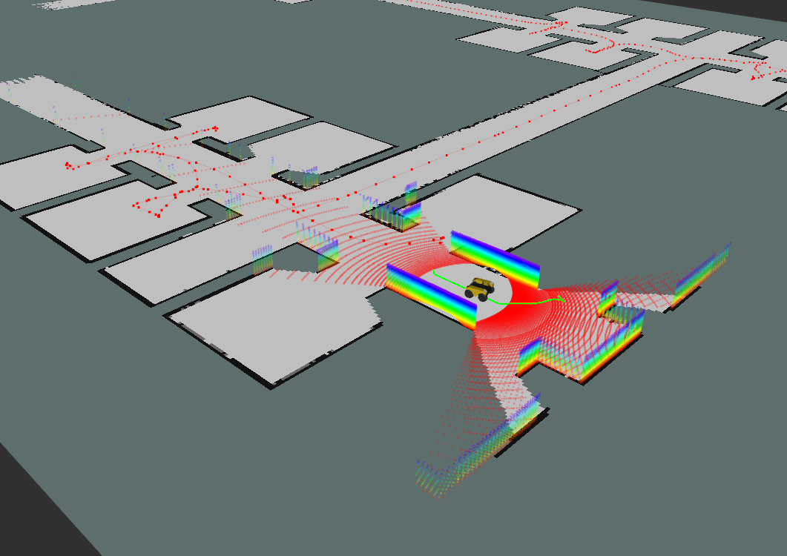

# LIO Active SLAM

This package implements Graph-based SLAM with active exploration capabilities.



## Dependencies

### ROS Dependencies
Make sure you have the following ROS packages installed:
```bash
sudo apt-get install ros-<distro>-tf2-ros ros-<distro>-tf2-geometry-msgs ros-<distro>-tf2-sensor-msgs
```

Replace `<distro>` with your ROS distribution (e.g., noetic, melodic).


### Python Dependencies
Install required Python packages:
```bash
pip install -r requirements.txt
```

## GTSAM Installation

GTSAM requires special installation:

### Option 1: Using pip
```bash
pip install gtsam
```

### Option 2: Building from source
For more advanced configurations or if pip fails:
```bash
# Install dependencies
sudo apt-get install cmake build-essential libboost-all-dev
git clone https://github.com/borglab/gtsam.git
cd gtsam
mkdir build && cd build
cmake -DGTSAM_USE_SYSTEM_EIGEN=ON -DGTSAM_BUILD_PYTHON=ON ..
make -j8
sudo make install
```

## pyastar2d Installation

pyastar2d is used for efficient A* path planning:
```bash
pip install pyastar2d
```

## Running the Code

1. Start ROS master:
```bash
roscore
```

2. Run the main SLAM node:
```bash
rosrun lio_active_slam LIO.py
```

## Configuration

Key parameters can be configured in the constructor of the `graph_active_slam` class:
- `sim_env`: Simulation environment
- `lidar_range_noise`: Lidar range noise parameter
- `R_odom`: Odometry noise covariance matrix
- `keyframe_distance`: Minimum distance between keyframes
- `keyframe_angle`: Minimum angle between keyframes
- `loop_closure_threshold`: ICP fitness threshold for loop closure
